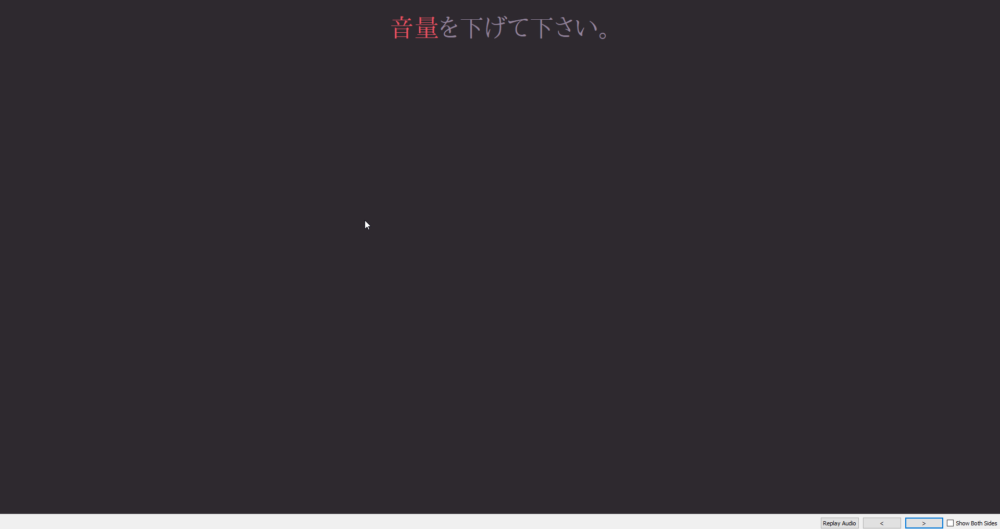

# Kanji Hover
A kanji script for Anki

# How To Use

Download \_kanjiHover.js and add the following line to your note:

``

**Note:** By default, Kanji Hover will not automatically scan your entire card. Instead, it is only active inside `
`. If you would like it to encompass the entire card, wrap the entire card in that div like so:

# Changing The Appearance

The css for the popup can be changed in two ways:

1. Edit the script itself, at the bottom there is a big block of css that you can edit.
2. Using Anki's Styling area. The area you point at is `.kanjiTooltip`, the popup is `.kanjiTooltipText`, and the red text is `.hoverText`.

# Compatibility & Issues

**This script is not compatible with the "kanjax with koohii" script.** If you try to use both, very bad things will happen. I'm still investigating the reason for the incompatibility, and I'll update the script if I figure it out.

Other than that, there very well may be more errors that come up. If you find anything, either make an issue or message me on Discord.

# Sources
This project uses the API provided by https://kanjiapi.dev.
